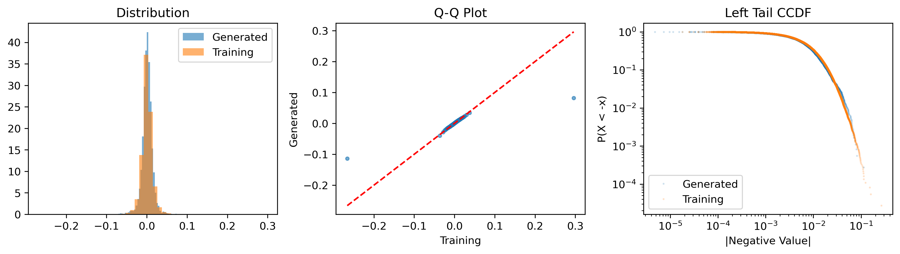
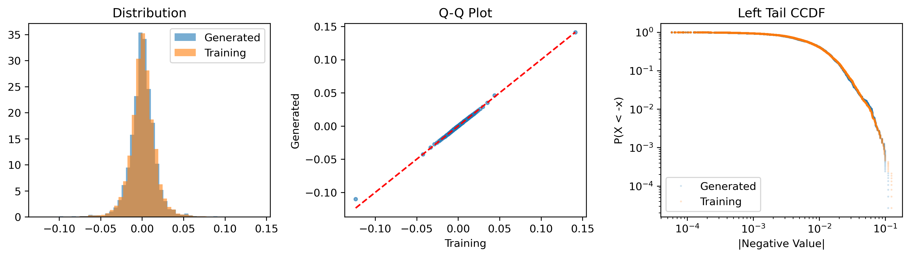

## Dataset

1. [stocknet](https://github.com/yumoxu/stocknet-dataset) 

2. S & P 500 (self made) [TODO]

## Benchmark

1. [Diffusion Factor Models](https://github.com/xymmmm00/diffusion_factor_model)
2. [Stationary Bootstrap](https://www.stat.purdue.edu/docs/research/tech-reports/1991/tr91-03.pdf)

## Evaluations

### Distribution with the training data.

1. For each stock, extract movement percent (daily return): $r_t = (P_t - P_{t-1}) / P_{t-1}$
2. Align 8 stocks to common trading dates (1257 days)
3. Generate scenarios using sliding window:
   - Window size: 8 days
   - Step size: 1 day
   - Windows with fewer than 32 days are discarded
4. Missing values are handled using linear interpolation

In the end we get an dataset of shape [1250, 8, 8]. This is how we trained the factor model.
Afterwards, to test the factor model, we generate 128 scenarios to get the shape of [128, 8, 8]. Then we evaluate the sampled data distribution compared to the training data.

To test the stationary bootstrap, we sampled [1257, 8] and use window size 8 and stride 1 to get [1250, 8] on both training data and resampled data.
#### Evaluation Results

| Method | MMD | Cov Error | ES (5%) | ACF | Mean | Std | Skew | Kurt |
|--------|-----|-----------|---------|-----|------|-----|------|------|
| GT | - | - | -0.0306 | 0.0716 | 0.0006 | 0.0136 | 0.1767 | 12.1850 |
| factor_DM | 0.002790 | 0.307484 | -0.0304 | 0.0759 | 0.0011 | 0.0128 | -0.4561 | 5.5397 |
| stationary bootstrap | 0.000000 | 0.210477 | -0.0357 | 0.0757 | 0.0007 | 0.0157 | -0.0017 | 5.9343 |

 Factor_DM

Stationary Bootstrap 
### Generate strategies based on tail scenarios, test on real crisis, and evaluate the performance.

### Use the generated scenario to test benchmark strategies, should perform worse than normal