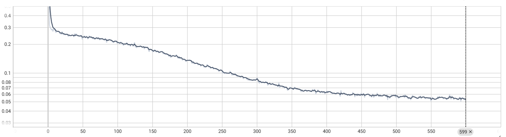
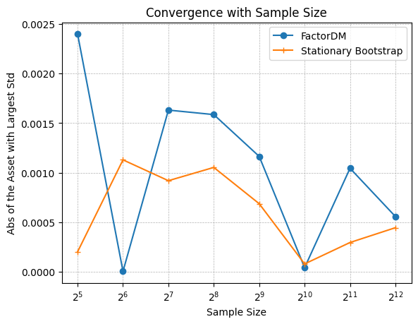
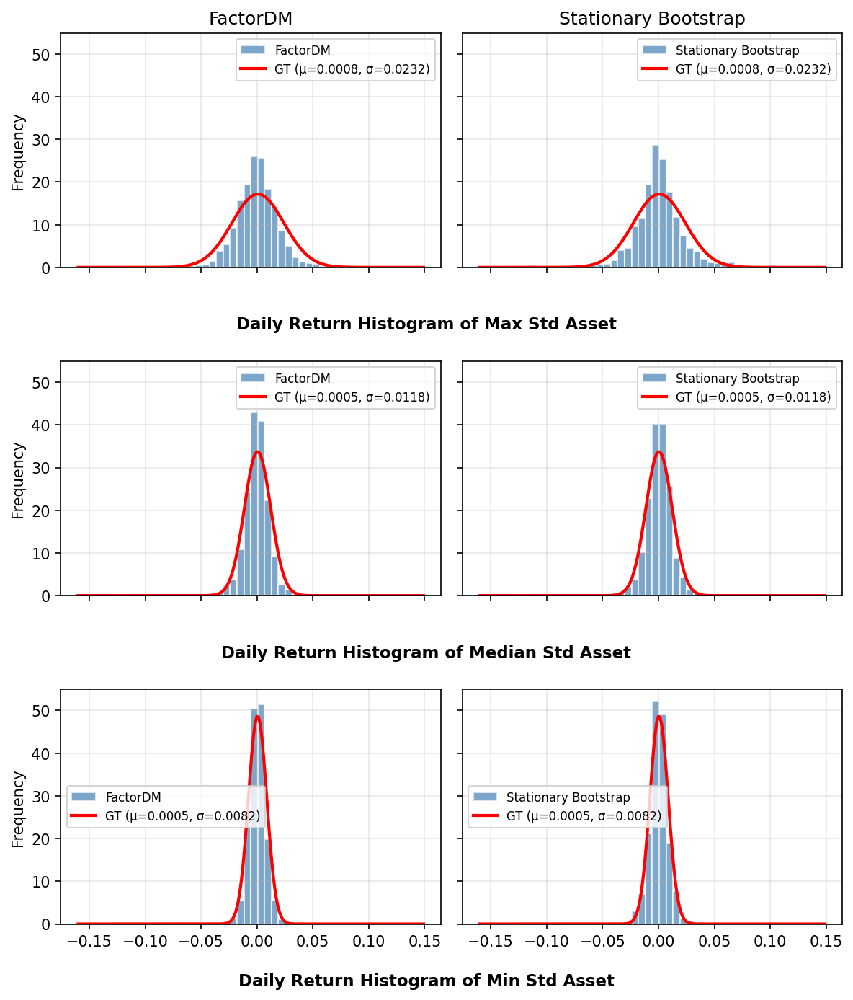

## Dataset

### [stocknet](https://github.com/yumoxu/stocknet-dataset)
Stocknet tracks Two-year price movements from 2012-09-04 to 2017-09-01 of 88 stocks are selected to target, 
coming from all the 8 stocks in the Conglomerates sector and the top 10 stocks in 
capital size in each of the other 8 sectors.

The preprocessing steps are as follows:
1. For each stock, extract movement percent (daily return of close price): $r_t = (P_t - P_{t-1}) / P_{t-1}$
2. Remove stocks that has missing days (81 stocks left)
3. Missing values are handled using linear interpolation

The final dataset has shape [1257, 81] (1257 days, 81 stocks).

### S & P 500 (self made)

The collected dataset from https://www.kaggle.com/datasets/camnugent/sandp500/data 

contains 2013-02-08 to 2018-02-07 of SP500 constituent stocks

1. For each stock, extract movement percent (daily return of close price): $r_t = (P_t - P_{t-1}) / P_{t-1}$
2. Remove stocks that has missing days (470 stocks left)
3. Missing values are handled using linear interpolation

The final dataset has shape (491, 4278) (4278 days, 491 stocks).

## Benchmarks

1. [Diffusion Factor Models](https://github.com/xymmmm00/diffusion_factor_model)
2. [Stationary Bootstrap](https://www.stat.purdue.edu/docs/research/tech-reports/1991/tr91-03.pdf)

## Experimental Setting

For Factor DM, we follow the default training/sampling setting: batch size 32, learning rate 1e-4, 600 epochs.
cosine noise scheduler, 200 sampling step.

  
  
Training Loss (MSE)

For stationary bootstrap, we set the block size = 8 (p = 0.125), we stop until we got [1257, 81], when
sampling we randomly select 1 cross-section with replacement.

Then we sample scenarios and overall we get [sample_size, 81] samples from each benchmark,
and we compare the generated samples with the training data using various metrics. 
We mainly focus on distribution similarity and marginal statistics of each asset. The sampling size is 
decided by following process.
1. Generate 4096 samples from each method
2. Slice it as [32, 64, 128, 256, 512, 1024, 2048, 4096]
3. Choose the size that gives a stable mean of the distance to the training set.

  
  
  
Distance of all stocks(left) and largest variance stock(right) with the training set

Based on the above results, we choose sample size = 2048 for both methods. This balances stability and efficiency

## Evaluation Results

We evaluate the quality of generated scenarios by comparing their distribution similarity and marginal statistics with the training data. The results are summarized in the table below.

| Method | MMD↓   | Cov↓ | ES↓ | Mean↓ | Std↓ | Skew↓ | Kurt↓ |
|---|-------|---|---|---|---|---|---|
| FactorDM | 0.0412 | 0.1943 | 0.0979±0.05 | -0.4953±3.00 | -0.1006±0.03 | -1.3566±3.26 | -0.3632±0.28 |
| Stationary Bootstrap | 0.0000 | 0.0785 | 0.0257±0.04 | 0.3907±1.56 | -0.0082±0.03 | 2.2752±17.37 | -0.0423±0.23 |

 Result on Distribution Comparing

  

## Downstream Task
The generated scenarios can be used for 
Risk Management(Stress Testing) or Portfolio Optimization.

### Risk Management
We assume a fixed equal-weight portfolio ($w_i = 1/d$) and evaluate the risk metrics of the portfolio under the generated scenarios.
For each method, we compute portfolio returns $r_p = X \cdot w$ from the generated scenarios,
then calculate risk metrics directly from the portfolio return distribution.

| Method | VaR₅% | ES₅% | Vol | MaxLoss |
|---|---|---|---|---|
| Historical (GT) | -0.0120 | -0.0168 | 0.0072 | -0.0385 |
| FactorDM | -0.0114 | -0.0164 | 0.0066 | -0.0350 |
| Stationary Bootstrap | -0.0109 | -0.0158 | 0.0070 | -0.0367 |

 Risk Metrics under Equal-Weight Portfolio 

### Portfolio Optimization
We can use the generated scenarios to estimate the mean and covariance of asset returns, and then construct
a mean-variance portfolio. For cross-sectional we only get 1 day output, we need temporal or dependence modeling to get multi-day output

### Appendix: Metrics

#### Distribution Similarity

**MMD (Maximum Mean Discrepancy)** measures the distance between two distributions using a Gaussian RBF kernel. Lower is better.

$$\text{MMD}^2 = \frac{1}{n(n-1)}\sum_{i \neq j} k(x_i, x_j) + \frac{1}{m(m-1)}\sum_{i \neq j} k(y_i, y_j) - \frac{2}{nm}\sum_{i,j} k(x_i, y_j)$$

where $k(a, b) = \exp\left(-\frac{\|a - b\|^2}{2\sigma^2}\right)$, $\sigma$ is the median pairwise distance, $n$ is the number of generated samples, and $m$ is the number of training samples.

**Cov Error (Covariance Error)** is the relative Frobenius norm error between covariance matrices:

$$\text{Cov Error} = \frac{\|\Sigma_{sample} - \Sigma_{train}\|_F}{\|\Sigma_{train}\|_F}$$

where $\Sigma_{sample}, \Sigma_{train} \in \mathbb{R}^{d \times d}$ are the covariance matrices of d assets.

#### Marginal Statistics
- **Left ES (Expected Shortfall / CVaR)** measures the left tail behavior of the scenarios
$$\text{ES}_\alpha = \mathbb{E}[X \mid X \leq \text{VaR}_\alpha]$$
where $\text{VaR}_\alpha$ is the $\alpha$-quantile. We use $\alpha = 5\%$ and only consider left tail.
- **Mean** summarizes the central tendency of the scenarios $\bar{x} = \frac{1}{n}\sum_i x_i$
- **Std** measures volatility $\sigma = \sqrt{\frac{1}{n}\sum_i (x_i - \bar{x})^2}$
- **Skew** measures asymmetry of the distribution $\gamma_1 = \mathbb{E}\left[\left(\frac{x - \mu}{\sigma}\right)^3\right]$
- **Kurt (Excess Kurtosis)** measures tail heaviness and peakedness relative to a normal distribution; higher values indicate more extreme outliers/heavier tails. 
$\gamma_2 = \mathbb{E}\left[\left(\frac{x - \mu}{\sigma}\right)^4\right] - 3$

All marginal statistics are computed asset-wise and we record the relative value comparing to GT, their mean and std across all assets are reported.

#### Risk Metrics

Given a portfolio with weights $w \in \mathbb{R}^d$, the portfolio return under scenario $x$ is $r_p = w^\top x$.

**VaR (Value at Risk)** is the $\alpha$-quantile of the portfolio return distribution. It represents the worst loss at confidence level $1-\alpha$.

$$\text{VaR}_\alpha = \inf\{l : P(r_p \leq -l) \leq \alpha\}$$

We use $\alpha = 5\%$ (left tail).

**ES (Expected Shortfall / CVaR)** is the expected loss given that the loss exceeds VaR. It captures the average severity of tail losses.

$$\text{ES}_\alpha = \mathbb{E}[r_p \mid r_p \leq \text{VaR}_\alpha]$$

**Volatility (Vol)** is the standard deviation of portfolio returns $\sigma_{r_p} = \sqrt{\text{Var}(r_p)}$.

**Max Loss** is the worst single-scenario portfolio return $\min_i r_{p,i}$.
