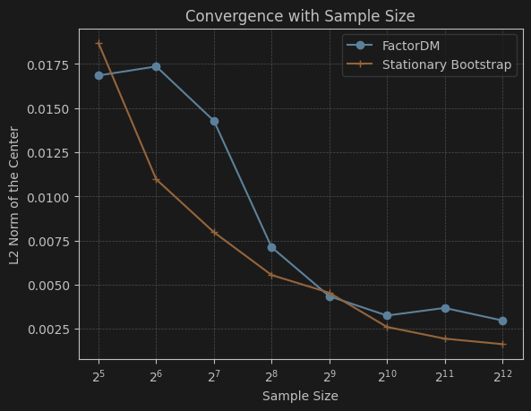

## Dataset

### [stocknet](https://github.com/yumoxu/stocknet-dataset)
Stocknet tracks Two-year price movements from 01/01/2014 to 01/01/2016 of 88 stocks are selected to target, 
coming from all the 8 stocks in the Conglomerates sector and the top 10 stocks in 
capital size in each of the other 8 sectors.

The preprocessing steps are as follows:
1. For each stock, extract movement percent (daily return of close price): $r_t = (P_t - P_{t-1}) / P_{t-1}$
2. Remove stocks that has missing days (81 days left)
3. Missing values are handled using linear interpolation

The final dataset has shape [1257, 81] (1257 days, 81 stocks).

### S & P 500 (self made) [TODO]

## Benchmarks

1. [Diffusion Factor Models](https://github.com/xymmmm00/diffusion_factor_model)
2. [Stationary Bootstrap](https://www.stat.purdue.edu/docs/research/tech-reports/1991/tr91-03.pdf)

## Experimental Setting

For Factor DM, we follow the default training/sampling setting: batch size 32, learning rate 1e-4, 600 epochs.
cosine noise scheduler, 200 sampling step.

 Training Loss (MSE)

For stationary bootstrap, we set the block size = 8 (p = 0.125), we stop until we got [1257, 81], when
sampling we randomly select 1 cross-section with replacement.

Then we sample scenarios and overall we get [sample_size, 81] samples from each benchmark,
and we compare the generated samples with the training data using various metrics. 
We mainly focus on distribution similarity and marginal statistics of each asset. The sampling size is 
decided by following process.
1. Generate 4096 samples from each method
2. Slice it as [32, 64, 128, 256, 512, 1024, 2048, 4096]
3. Choose the size that gives a stable mean.

Based on the above results, we choose sample size = 2048 for both methods. This balances stability and efficiency

## Evaluation Results

| Method | MMD | Cov Error | ES (5%) | ACF | Mean | Std | Skew | Kurt |
|--------|-----|-----------|---------|-----|------|-----|------|------|
| GT | - | - | -0.0306 | 0.0716 | 0.0006 | 0.0136 | 0.1767 | 12.1850 |
| factor_DM | 0.002790 | 0.307484 | -0.0304 | 0.0759 | 0.0011 | 0.0128 | -0.4561 | 5.5397 |
| stationary bootstrap | 0.000000 | 0.210477 | -0.0357 | 0.0757 | 0.0007 | 0.0157 | -0.0017 | 5.9343 |

 Factor_DM

Stationary Bootstrap 

### Appendix: Metrics

#### Distribution Similarity

**MMD (Maximum Mean Discrepancy)** measures the distance between two distributions using a Gaussian RBF kernel. Lower is better.

$$\text{MMD}^2 = \frac{1}{n(n-1)}\sum_{i \neq j} k(x_i, x_j) + \frac{1}{m(m-1)}\sum_{i \neq j} k(y_i, y_j) - \frac{2}{nm}\sum_{i,j} k(x_i, y_j)$$

where $k(a, b) = \exp\left(-\frac{\|a - b\|^2}{2\sigma^2}\right)$, $\sigma$ is the median pairwise distance, $n$ is the number of generated samples, and $m$ is the number of training samples.

**Cov Error (Covariance Error)** is the relative Frobenius norm error between covariance matrices:

$$\text{Cov Error} = \frac{\|\Sigma_{sample} - \Sigma_{train}\|_F}{\|\Sigma_{train}\|_F}$$

where $\Sigma_{sample}, \Sigma_{train} \in \mathbb{R}^{d \times d}$ are the covariance matrices of d assets.

#### Marginal Statistics
- **Left ES (Expected Shortfall / CVaR)** measures the left tail behavior of the scenarios
$$\text{ES}_\alpha = \mathbb{E}[X \mid X \leq \text{VaR}_\alpha]$$
where $\text{VaR}_\alpha$ is the $\alpha$-quantile. We use $\alpha = 5\%$ and only consider left tail.
- **Mean** summarizes the central tendency of the scenarios $\bar{x} = \frac{1}{n}\sum_i x_i$
- **Std** measures volatility $\sigma = \sqrt{\frac{1}{n}\sum_i (x_i - \bar{x})^2}$
- **Skew** measures asymmetry of the distribution $\gamma_1 = \mathbb{E}\left[\left(\frac{x - \mu}{\sigma}\right)^3\right]$
- **Kurt (Excess Kurtosis)** measures tail heaviness and peakedness relative to a normal distribution; higher values indicate more extreme outliers/heavier tails. 
$\gamma_2 = \mathbb{E}\left[\left(\frac{x - \mu}{\sigma}\right)^4\right] - 3$

All marginal statistics are computed asset-wise, their mean and std across all assets are reported.
